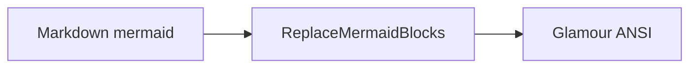

## 目录
1. [模块](#模块)
2. [图表示例](#图表示例)
3. [相关测试](#相关测试)

---

## 模块

`internal/render.ReplaceMermaidBlocks`：在 Glamour 前将 mermaid 围栏投影为 Unicode 艺术字。

## 图表示例

非法 mermaid 保留源码，不崩溃。

## 相关测试

- `internal/render/mermaid_test.go`
- 冒烟：`test/smoke` 扫描 posts + 投影
