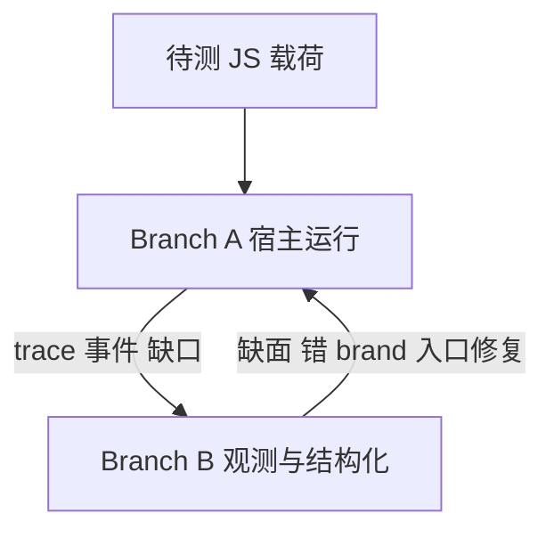
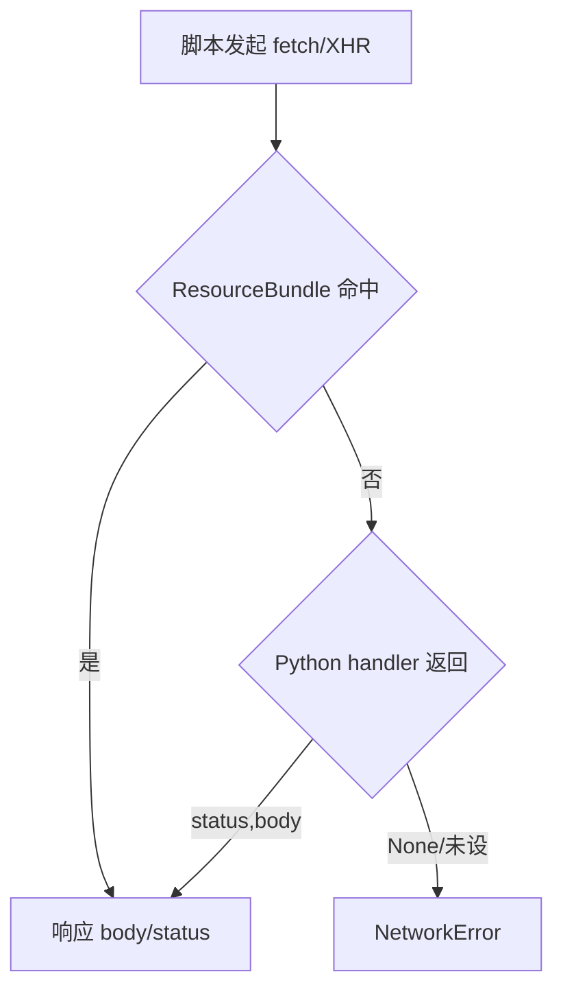

## 前置

iv8-rs 要解决的不是「再包一层能 `eval` 的 V8」，而是：

**在一个 Python 进程里，让复杂 Web 脚本（含 JSVMP / ChaosVM 类载荷）在可控、可复现、足够像浏览器的宿主中跑起来，并把这次运行变成可对照、可切片、可反馈回宿主的证据。**

这条路的起点是 **参考 iv8**（PyPI `iv8` 0.1.4，维护者 HanZzzzz000）——它证明了「Python 里嵌 V8、用环境字典驱动浏览器面、离线优先」是一条能跑通的产品缝。iv8-rs 在这条缝上再压一层：宿主要更真，分析要更正，双边要闭环。

本文按两条线展开：

1. **设计与内核**：问题、双分支哲学、Branch A 宿主要装什么、Branch B 分析要看见什么、插桩接缝、组件与调用、API 心智顺序。
2. **价值与边界**：在真实 Web 载荷上，这套宿主 + 分析已经证明了什么、边界在哪；案例以能力价值为主，编号仅作对齐。

| 项 | 值 |
|---|---|
| 产品 | **iv8-rs** |
| 公开代码 | <https://github.com/lgnorant-lu/ming_iv8_rs> |
| 包名 / import | `ming_iv8_rs` / `import iv8_rs` |
| 协议 | Apache-2.0 |
| 启蒙参考与对照 | 参考 **iv8**（PyPI 0.1.4，HanZzzzz000，长期双引擎 Oracle） |
| 包版本 | **0.8.12**（开发 continuum 另有里程碑 tag 叙事） |

本文只谈技术与架构。不提供未授权绕过、过站或攻击配方。样本结果是历史联调笔记，不是线上 SLA。

---

## 一、问题从何来

### 1.1 三条常见路各自卡在哪里

| 路径 | 看起来能做什么 | 真正卡点 |
|---|---|---|
| 纯 Node / 纯 Python | 跑逻辑、算哈希 | 浏览器对象模型几乎不存在；`instanceof`、accessor、Worker、Intl、DOM 集合语义经常错 |
| 完整 Chrome + CDP | 最接近真浏览器 | 重、难离线、难把「只关心某段 VM」稳定塞进自动化；成本与可重复性差 |
| 薄 stub 补环境 | 补几个 `navigator` 字段 | 过不了 brand check、canvas/WebGL/crypto、HTMLCollection/NodeList 行为、Illegal invocation |

「补环境」如果只停在 **字段字典**，对现代页面和签名 VM 往往不够。脚本会：

- 用 **原型链 / brand** 判断对象是不是「真 DOM / 真 API」；
- 用 **getter 副作用** 探测环境；
- 用 **集合迭代、通配查询、事件、Worker** 组织执行；
- 在 **XHR/fetch** 与 **定时器** 上推进状态机。

缺任何一层，表现常常是半道挂起或「签名形态对了但厚度不对」，而不是一句干净的 TypeError。要把这类脚本放进 CI 与双引擎对照，需要的是 **可编程、可冻结、可离线喂资源的宿主**，而不是再开一个不可控的浏览器窗口。

### 1.2 参考 iv8：启蒙者与对照引擎

参考 **iv8**（PyPI `iv8`，撰文时稳定线为 **0.1.4**，维护者 HanZzzzz000）给出的产品直觉非常清晰：

- 把 **V8 嵌进 Python**；
- 用 **环境字典** 驱动浏览器面；
- **离线优先**，适合把目标脚本放进自动化与示例管线。

对 iv8-rs 而言，它至少扮演两种角色：

1. **启蒙者**：证明「Python + V8 + 环境注入」这条产品缝成立，而不是空想。没有这条缝被跑通，后面谈「更深宿主」与「卧底分析」都缺少现实锚点。
2. **双引擎 Oracle**：同一脚本在参考 iv8 与 iv8-rs 上跑，做 form dual / both_ok，用来判断「是宿主差分还是算法差分」。

二者 **不是** 上下游交付关系，也 **不是** 简单 fork 叙事。iv8-rs 在同一条缝上换了更重的工程期望：Rust 工作区、更大表面、插桩与分析、样本轨与升核准则。后文凡写 dual / both_ok，默认对照对象都是这条 **0.1.4** 线。

读 dual 时建议固定三角：**浏览器**（真全局/厚度）· **参考 iv8**（同缝薄引擎）· **iv8-rs**（交付主体）。于第七节每个案例都会再写清：样本脚本怎么串、两边引擎比什么、输出文本长什么样——避免只剩「PASS/FAIL」口号。

### 1.3 iv8-rs 在同一条缝上再压什么

1. **运行时环境**（Branch A）：大面积 native + codegen 的 Web 表面，确定性时钟/种子，离线网络链，Worker/Intl 等硬点。
2. **运行时分析**（Branch B）：插桩、统一 trace、入口平面、诊断报告，并指向更深的动态分析 / IR/SSA 期望态。
3. **两边必须闭环**：环境抬高分析质量；分析反指环境缺口。二者香福香橙~~(左脚踩右脚上天)~~。

若用能力域粗列（与 README 一致，细节后文展开）：

| 能力域 | 一句话 |
|---|---|
| 运行时宿主 | `JSContext`、同线程 isolate、大栈、逻辑/系统时钟、seeds |
| 浏览器面与 DOM | Window/Navigator/Screen/Location、DOM 解析查询、EventTarget、集合、Worker |
| Crypto / Canvas / WebGL / Audio | SubtleCrypto、tiny-skia Canvas、WebGL 参数面、Audio |
| 网络与事件循环 | ResourceBundle → handler → 错误；定时器推进 |
| 反检测积木 | wrap/hook、chrome 对象、toString/brand 卫生（非过检承诺） |
| 插桩与可观测 | `instrument_source`、统一 trace、CDP/`Debugger`、recording/profiler |
| 入口 / bundler | prepare/run/multi-entry；chunk 自备 |
| 环境工具链 | probe/pressure/toolchain **报告**（默认诊断向） |

### 1.4 诚实边界

| 不声称 | 现实 |
|---|---|
| 完整 Chromium / Blink | 大面积 IDL + 有意 stub；parity 持续工作 |
| 自动拉取全部 bundler chunk | 离线优先；调用方供码 |
| 静默公网网络产品 | ResourceBundle 优先 |
| 环境工具链自动修宿主 | 默认诊断报告 |
| 与 PyPI `iv8` 0.1.x 同一产品 | 相关谱系 / 双引擎 oracle；**本产品为 iv8-rs** |
| 过所有检测器 / 一键过站 | 宿主保真积木 + 样本轨边界，不是 bypass 套件 |

---

## 二、设计哲学：双分支、同一进程

### 2.1 总命题

| 分支 | 名称 | 核心问题 |
|---|---|---|
| **A** | 运行时环境（宿主） | 脚本能否在可控的类浏览器宿主里 **跑起来** |
| **B** | 运行时分析 | 这次运行 **做了什么**，能否观测、结构化、再推理 |

当前交付可以诚实写成：

- **Branch A：重量级、已交付、持续加深**
- **Branch B：可用脊梁已交付 + 明确 north star**

Branch A 回答的是 **可执行性**：同一输入、同一种子、离线资源、同线程 isolate，脚本能否完成关键路径。
Branch B 回答的是 **可解释性**：统一 trace、插桩、入口规划、结构/模式/诊断，能否把运行变成可对照的证据。
两者缺一不可：只有 A，会陷入「永远补字段」；只有 B，会陷入「做空中楼阁的分析」。

### 2.2 为什么必须是「同一进程」

如果 A 在浏览器、B 在另一套 Node 插桩器：

- 环境语义不一致，dual 失去意义；
- 插桩看到的「世界」和签名脚本跑的「世界」不是同一个；
- 反馈环断裂：分析发现缺 `plugins`，却无法在同一 isolate 里立刻改环境重跑。

iv8-rs 的选择是：**一个 Python 进程、明确管理的 V8 isolate、同一套 environment 注入**，让 A 与 B 共享真相源。这是相对「纯静态 deobf CLI」与「纯浏览器人工点点点」的结构性折中：既可自动化，又保持同一世界。

### 2.3 闭环



1. **A 到 B：** 宿主不真，trace 是噪声，Illegal invocation 会盖住真逻辑。
2. **B 到 A：** probe、diff、采集面对照指出哪些 getter、集合、网络边仍在说谎。
3. **里程碑：** 要么加固宿主，要么加深观测，要么收紧两者契约。

### 2.4 哲学层只定边界，细节进后文

本节只回答「为什么是双分支、为什么同一进程、闭环是什么」。
**Branch A 装什么**见第三节；**Branch B 看见什么、IR/SSA 期望态**见第四节；**插桩接缝**见第五节；**升核准则**在第三节末，**载荷上的价值与边界**在第七节。

用一张「读者地图」串起来：

| 你想先搞懂 | 读哪一节 |
|---|---|
| 为什么不是 Node / 纯 stub | 一 |
| 双分支与闭环 | 二 |
| 大栈 / ICU / 离线网 / 集合 | 三 |
| IR、SSA、oracle、north star | 四 |
| Path A 与两个插桩 API | 五 |
| 怎么调、调什么 | 六 |
| 真实载荷上的价值与边界 | 七 |

---

## 三、Branch A：宿主要装什么

### 3.1 按依赖顺序装世界

脚本「以为自己在页面里」，依赖大致是：内核先成立，再装表面，再谈媒体/密码、网络与身份。顺序不能反——没有 isolate 与时钟，表面装了也跑不稳；没有集合与 brand，签名 VM 在枚举节点阶段就会静默偏航。

| 层 | 原理问题 | 若做错会怎样 | 实现要点 |
|---|---|---|---|
| 内核 | 是否同一世界、时间是否可控、Intl 是否可信 | 随机炸、时区错、ICU 导致 init 级失败 | 同线程 isolate；大栈；ICU 77；`time_mode` / seeds |
| 表面 | brand 与集合语义是否像浏览器 | `instanceof` 失败、for-of 崩、通配查询错 | codegen + native；EventTarget；NodeList 等 |
| 媒体/密码 | 业务/指纹脚本是否读到「像真的」API | 空实现被探测；或固定指纹被识别 | Canvas/WebGL/Audio/SubtleCrypto |
| 网络 | 是否可离线复现又允许受控回落 | 静默打公网不可复现；或全断导致脚本卡死 | Bundle 优先 → handler → 错误 |
| 身份 | 默认像浏览器且可覆盖 | 全网同一身份；或覆盖无效 | profile + 点路径 env |
| 反检测积木 | 高信号点是否自爆 | toString/brand 一眼假 | wrap/hook、chrome 对象等；**非过检承诺** |

表面层尤其容易被低估。现代页面与签名 VM 大量依赖：

- **brand / `instanceof`**：对象是不是「真」的 DOM/API 实例；
- **accessor 语义**：getter 是否带副作用、是否可配置/可枚举符合预期；
- **集合契约**：`NodeList`/`HTMLCollection` 是否可迭代、`getElementsByTagName('*')` 是否真返回全部元素；
- **事件与定时器**：状态机能否推进。

这些不是「补几个字段」能代替的。VM-017 的升核正例（见 **§7.4**）正是表面层语义错误导致「装不上全局工厂」。

### 3.2 几个「看起来像细节、其实是生死线」的点

**大栈。** 大规模 Web IDL 模板与 mixin 合并会在 V8 侧吃掉很深的 C++ 栈。Python 线程默认栈不够时，表现可能是挂起或难查的失败，而不是一句清晰错误。因此 import 路径会抬高 `threading.stack_size`，Rust 测试侧使用 `RUST_MIN_STACK`。样本轨测试也习惯在大栈线程里创建 `JSContext`——见后文 Akamai d1、TDC 等测试片段的共同写法。

**ICU。** 错误的 `icudtl.dat` 会让 Intl/时区路径直接不可用。美团 H5guard 路径上，错误 ICU 曾表现为 init 级失败或伪 OOM；换上匹配的 ICU 77 数据（`set_common_data_77` + 包侧 `icudtl.dat` / `IV8_ICUDTL_PATH`）后，init/sign/getfp 的 **形态 dual** 才能成立。这是 Branch A 正确性，不是「分析不够」。时区侧还有环境 `timezone` → 进程 `TZ` + isolate `TimeZoneDetection::Redetect` 的链路。

**确定性。** `time_mode=logical`、`random_seed` / `crypto_seed`、`time_freeze` 用于可复现；`system` 用于贴近真实时间。没有确定性，双引擎对照与 CI 回归都会变成噪声：同一脚本两次 run 的熵字段无法解释是「环境差」还是「时钟差」。

**离线网络默认。** 没有 ResourceBundle、没有 handler，网络应失败，而不是偷偷上网。否则「本地能跑、CI 不能跑」「今天能跑、明天证书变了」会毁掉样本轨的可信度。这与入口平面「chunk 调用方自备」是同一哲学：可复现优先于便利。

**集合与迭代。** 看起来像「DOM 小功能」，实际上是签名 VM 装全局工厂的前置条件。`getElementsByTagName('*')` 若把 `*` 当普通 tag、NodeList 若不可 for-of，页面脚本会在枚举节点阶段静默偏航——后文 VM-017 是升核正例。

### 3.3 配置覆盖链

意图优先级：

```text
用户显式 environment
  > profile
  > 冷启动基线
```

冷启动基线是一份点路径默认环境表（约四百键量级），编译期嵌入内核。它是 **环境默认表**，会碰到 navigator/webgl/canvas 等键，但 **不是** 完整指纹产品库——许多 fingerprint 相关槽位是空串或开关占位，表示「默认走宿主路径」，而不是塞死一套固定指纹图。

实现上用 **用户键集合**（`user_keys`）区分用户写过的键与基线键：native getter 可以问「这是用户强制的，还是基线默认的」，避免 baseline 误盖 profile（历史 D-111 类问题）。嵌套 dict 在 Python 工厂层会扁平化为点路径，便于与基线表同一套查找语义。

后续架构方向：让 **profile + 用户 environment** 成为更清晰的 SoT，基线只做未覆盖时的底——不改变「今天如何调用」的理解，但解释为何基线路径会成为构建硬依赖。

### 3.4 网络链



这是可复现性的核心设计之一：**先离线，再受控回落，最后显式错误。**

文字上再钉三条：

1. **ResourceBundle** 是第一公民：`add_resource(url, body, status=...)` 把脚本「以为的请求」变成本地表查找，CI 与双引擎对照才能稳定。
2. **Python handler** 是第二层，签名大致是「给 url/method，返回 `(status, body)` 或 None」——用于动态补洞，而不是默认上网。
3. **错误必须显式**：没有 Bundle、handler 返回 None，应得到网络错误，而不是静默成功。否则样本轨会出现「本机能跑、流水线不能跑」的假绿。

这与入口平面「chunk 调用方自备源码字符串」是同一哲学：便利让位于可复现。

### 3.5 内核 vs 样本分层

| 层 | 职责 | 不放这里 |
|---|---|---|
| L0 内核 | 标准 Web 宿主语义 | 单站 ACE 壳、单站签名算法 |
| L1 通用补环境 | 跨站高频、规格清晰 | 单站 SDK |
| L2 环境 pipeline | 决策与样本路由 | 全家桶站点资产 |
| L3 样本轨 | rehost / dual / live | 默认进 wheel |

**升核经验法则：** 同一缺口被 **无关样本多次** 打到，且规格清晰，才考虑进 L0/L1。
单站壳默认留在样本轨：可调试、可 hybrid，但不污染核心。
典型正例：NodeList 可迭代 + `getElementsByTagName('*')` 被签名 VM 打穿后升核（**§7.4** 输出与 call-log）；反例：某站 ACE 短 trampoline 默认不进 core（同一节 Path A 不声明 `_webmsxyw`）。

读样本时若「浏览器能装、自研不能装且无抛错」，优先怀疑 **L0 静默偏航**，而不是先写站点 bypass——第七节会用 call-log 与 form dual 文本把这条经验钉死。

---

## 四、Branch B：分析要看见什么（含 IR / SSA 深讲）

### 4.1 先校准概念：静态与动态不是二选一

项目内动态分析研究图强调：重要的不是「静态 vs 动态」二元对立，而是 **运行时分支与分析分支形成反馈环**——运行让样本可执行，分析提取证据，证据指导有针对性的运行时适配，校验保证改写保持可观察行为。

纯静态的长处是不执行对抗代码、可批处理；短处是对 `eval`、自修改、环境敏感的 VM 派发过于保守。
纯动态的长处是「看见真路径」；短处是覆盖不全、日志噪声大、缺少结构变换。
产业上 CASCADE、devirt-core 等都在走 **混合**：运行时 oracle + 结构化 IR/变换 +（可选）LLM 定位脆模式。

能力校准表：

| 能力 | 短含义 | 给 iv8-rs 什么 | 单独给不了什么 |
|---|---|---|---|
| 事件流 / trace | 有序执行观察 | 时间线、CFG 提示、模式证据 | 值谱系、语义证明 |
| Record/replay | 捕获再放 | 可重复窗口 | 自动等于真浏览器 |
| Shadow / taint | 元数据随值走 | 源到汇、污染可达 | 完整语义或求解器 |
| 动态切片 | 从目标反切相关事件 | 签名/cookie 相关子集 | 新路径发现 |
| 运行时 oracle | 受控运行折叠难静态式 | 字符串数组、prelude | 无隔离则不安全 |
| IR / SSA 改写 | 结构化分析与变换 | CFF/VM 后续底座 | 不能代替宿主正确性 |

### 4.2 此前已落地の部分

| 层 | 内容 |
|---|---|
| 插桩 | `instrument_source`（ChaosVM Path A）、`instrument_chaosvm`（全局表）、可选 env Proxy |
| Trace | 统一 `TYPE,PC,target,value`（D/R/C/W）、`trace_diff`、recording/profiler/coverage |
| 调试 | CDP / `with_devtools`、`Debugger` |
| 入口 | `prepare_entry` / `run_with_entry` / multi-entry；chunk **调用方自备** |
| 结构推理 | CFG / taint / pattern / crypto 检测、report 模型、环境诊断平面（默认报告向） |

这些已经能支撑：Path A 观测、双 run diff、入口规划、部分 deobf 前处理与诊断报告。它们构成 Branch B 的 **脊柱**。

与后文样本的对应关系：

- **TDC / ChaosVM** 直接锤 **插桩 + 统一 trace**（`D,` 派发行与 collect 同断言）。
- **Akamai d1** 锤 **宿主内算法 parity**（不必完整浏览器 telemetry）。
- **XHS / 美团** 锤 **三角对照 + 指标分层**（形态 dual 与厚度分开写）。
- **入口平面** 在 bundler/hybrid 源码组织时出现：策略可分析向/运行时向，但 chunk 文本始终自备。

### 4.3 为什么还要谈 IR 与 SSA

统一 trace 回答的是「**发生了什么**」。
要回答「**如何把混淆程序变回可分析结构**」，往往还需要一层 **中间表示（IR）** 与 **静态单赋值（SSA）** 上的变换：

- **AST** 贴近源码，适合打印与局部改写，但难做跨基本块的数据流。
- **CFG** 适合控制流，但若没有 SSA，变量版本纠缠，常量传播与死代码消除容易算不干净。
- **SSA** 让每个赋值对应一个版本，汇合点用 phi；常量传播、死代码、控制流平坦化恢复等「编译器中端」手段才站得住。

对 JavaScript 混淆，常见目标包括：字符串数组解码、控制流平坦化（CFF）恢复、不透明谓词消除、以及部分 VM 保护的 devirtualize。这些目标在产业与开源里，越来越被表述成 **编译器问题**，而不是「再写一千条正则」。

以 **CFF** 为例：扁平化后，dispatch 变量在每个 case 末尾被写成常量，本质上编码了原始 CFG 的边。在 SSA 上对 dispatch 变量做 **条件常量传播（SCCP）到 fixpoint**，就能读出原始控制流，再 relooper 回 `if`/`while`。关键点是：pass **不识别「这是某种混淆器」**，它只优化 IR——混淆碰巧无法在优化下存活。这比「为每个混淆器写一条解混淆规则」稳得多。

### 4.4 外部参照一：Google JSIR 与 CASCADE

**JSIR**（Google 开源方向，基于 **MLIR** 的高层 JavaScript IR）的关键设计目标包括：

1. **尽量保留 AST 级信息**，使 IR 可以 **无损/高保真 round-trip 回源码**（source-to-source 变换的前提）。
2. 用 MLIR **region** 等机制表达控制结构，并提供 **数据流分析 API**。
3. 服务恶意 JS 分析、反混淆、甚至 Hermes 字节码抬升等场景。

与「只拿 AST 做局部 rewrite」相比，IR 的价值在于：可以在 **语义层** 做常量传播、折叠、内联一类变换，同时仍希望能打印回可读 JS。

**CASCADE**（Google 生产环境中的混合反混淆思路，论文公开）的关键分工更值得学：

- **LLM（如 Gemini）** 负责定位 **prelude**（混淆器生成的、操纵字符串的那套基础函数），而不是直接「生成整份反混淆代码」。
- **JSIR** 负责确定性变换：常量传播、内联等。
- **动态执行** 用于在沙箱中求值那些「看起来不幂等、实际可折叠」的解码调用。

也就是说：LLM 解决「脆规则写不完」的定位问题；IR 解决「变换要正确」的问题；运行时 oracle 解决「纯静态太保守」的问题。这与 iv8-rs「**可控 V8 宿主当 oracle + 结构化分析**」的方向高度同构——只是 iv8-rs 目前把更多工程压在 **宿主保真与统一 trace** 上，IR 中端仍是 north star。

### 4.5 外部参照二：devirt-core 与「把反混淆当编译器」

开源 **devirt-core** 一类工作的叙事是：通用、样本无关的 JS 反混淆器，像编译器一样跑 **fixpoint** 的语义保持变换，而不是为每个混淆器写规则。

公开描述中的关键构件包括：

- 用 **oxc** 做解析与 AST 层 pass；
- 用 **SSA IR** 做控制流恢复（支配关系、relooper 等）；
- 用 **Boa** 等沙箱执行字符串解码器，再把结果抬回源码；
- 用行为签名等方式做等价校验。

产业侧 devirt.dev 系列文章进一步强调：把 JS 抬到 SSA **本身就很难**——`var` 提升、`let`/`const` TDZ、属性访问可能触发 getter、`+` 可能触发 `toString`/`valueOf`、`eval`/`with` 会毁掉词法结构、闭包环境与 `this` 绑定都要显式建模。前端抬升若过于天真，中端的常量传播会在对抗输入上 **静默算错**。

这对 iv8-rs 的启示是：

1. **IR/SSA 不是「加一个数据结构」**，而是一整条「抬升—分析—回落—校验」工程。
2. **运行时 oracle**（在隔离环境中求值解码器）与静态 IR 变换是互补的，不是二选一。
3. **校验失败应保持源码不变**——研究图里对 runtime oracle 的硬规则之一。

### 4.6 iv8-rs 上的定位：今天、缺口、期望态

结合项目内动态分析研究图的 **能力适配矩阵**（摘要）：

| 能力 | 外部强参照 | iv8-rs 原生需求 | 主要卡点 |
|---|---|---|---|
| 语义化插桩 API | Jalangi2 / Aran / NodeProf | 稳定事件/探针 ID、源位置、类型化回调 | 现代语法、eval、async、Worker、builtin |
| 动态 taint | Foxhound 等 | 先从字符串/值影子与选定源汇开始 | 宿主/builtin 传播与隐式流 |
| 动态切片 | 经典动态切片论文 | trace/事件/切片应偏原生 | 精确依赖、堆/属性跟踪 |
| 运行时 oracle | CASCADE / devirt-core | **强：iv8 本身就是可控 runtime** | 纯度、隔离、副作用、校验 |
| IR/SSA 改写 | JSIR / devirt-core | 中高：CFF/VM 后期需要 | JS 堆/原型/eval/with/proxy 语义 |

**可复现性层级**（研究图用语）从 R0 论文到 R5 原生验证。当前多数外部候选仍在 R1–R2；**在达到 R4/R5 之前，不应把某外部工具称为「iv8 已具备的能力」**。

因此 Branch B 的诚实表述应是：

- **今天：** 统一 trace + Path A 插桩 + 结构/模式/入口/诊断报告，已经能做大量「跑得动、看得见、对得上」的工作。
- **缺口：** 动态依赖图式切片所需的事件字段仍不全；IR/SSA 中端未成为产品默认管线。
- **期望态：** 以观察目标为中心的切片、受治理的 oracle 求值、可选的 IR/SSA 结构化管线——与宿主闭环，而不是脱离 Branch A 的旁路玩具。

可以把期望态收成一条证据链（方向，不是已交付 checklist）：

```text
统一 trace / 事件
  -> CFG / 模式 / taint（脊梁已有）
  -> 动态切片（从签名/cookie 等目标反切）
  -> 运行时 oracle（隔离求值解码器 / prelude）
  -> IR/SSA 抬升与 fixpoint 变换（CFF/VM 后期）
  -> 回落源码 + 行为校验（失败则保持原样）
```

其中 **运行时 oracle** 是 iv8-rs 相对纯静态工具的结构性优势：同一 isolate、同一 environment，折叠结果可以立刻重跑验证。CASCADE 用沙箱执行 prelude、devirt-core 用 Boa 执行解码器——iv8-rs 则可以直接把「受控 V8 宿主」当作 oracle 底座，前提是纯度、隔离与副作用治理做到位。

### 4.7 与 Branch A 的再扣合

没有 Branch A：

- oracle 跑在错误环境上，折叠结果不可信；
- taint 源汇定义在假 DOM 上，结论无意义；
- IR 回落的代码仍无法在同一世界重跑验证。

所以 Branch B 的任何加深，都必须假设 **同一进程、同一 environment 真相源**。这是 iv8-rs 相对「纯静态 deobf CLI」的结构性优势，也是相对「纯浏览器人工点点点」的自动化优势。

---

## 五、插桩：A 与 B 的接缝

### 5.1 定义

> **插桩是跨分支公共件：在 A 的世界里执行，为 B 生产证据。**

它不是「早期 Branch B 的边角料」，也不是「纯 A 的附属」。没有 A，改写后的代码无处可跑；没有 B 的目标，不知道该在哪些派发点打点，也不知道 dual 对什么。Path A 在样本轨里极常用——TDC ChaosVM、部分签名 VM 都依赖它。

### 5.2 两个 API 的契约

| API | 假设 | 适用 | 误用表现 |
|---|---|---|---|
| `instrument_source` | 静态改写派发表达式；可处理闭包内表 | **推荐默认**（ChaosVM/TDC 类） | 未检出模式时显式失败 |
| `instrument_chaosvm` | handler 在 **globalThis** | 全局表 VM | 闭包表「装不上」——这是契约，不是偶然 bug |

契约上必须分清：**闭包 handler 表「装不上」不是 bug，是设计边界。** 强行用 `instrument_chaosvm` 注入闭包表，会得到「装了但 trace 是空的」的假象。

### 5.3 实现策略（Path A）

`instrument_source` 的实现可以拆成四步（与 `instrumentation.rs` 一致，经 TDC 验证，v0.8.101 Q165 加固）：

1. **检测或手动覆盖**
   - `mode="auto"`：先 `detect_chaosvm`，再回落 `detect_switch_vm`。
   - 也可手动给 `handler_array` / `pc_var` / `stack_var` / `index_array` / `dispatch_pattern`。
   - 检不出且无手动参数 → `RuntimeError`，提示补手动参数。

2. **生成 source-head**
   - 默认 `env_targets`：`navigator`、`screen`、`document`、`location`、`Math`、`crypto`、`performance`。
   - `capture_env=false` 关闭 Proxy；`env_targets=[...]` 精确白名单。
   - Proxy 必须 **host-safe**：`Reflect.get(target, prop, target)`，避免 `screen.width` / `navigator.userAgent` 一类 brand-checked getter 因 wrong receiver 触发 Illegal invocation。

3. **替换全部 dispatch 站点**
   - 对 `H[I[P++]]()` 及空白变体做 **全站点** 替换为日志 wrapper（含 offset==0 的站点，避免只改第一处）。
   - 每条 VM 迭代写 `D,pc,opcode,stack...`；`dispatch_count` / `dispatch_offsets` 写入 `info`。

4. **拼装 `info` 回报**
   - `mode`、`handler_array`、`pc_var`、`stack_var`、`dispatch_pattern`、`dispatch_count`、`recommended_api="instrument_source"`。
   - `q165_note` 明确：Path A 服务闭包表；`instrument_chaosvm` 要求全局表。
   - 默认 `expose_handlers=false`（是否把 handler 挂到 globalThis——检测面权衡）。

输出统一 trace 行：

```text
TYPE,PC,target,value
```

`TYPE` 常见 D/R/C/W（派发 / 读 / 调用 / 写）。这是分析侧的 **协议形状**，也是双引擎 diff 的接口。`trace_diff` 用于两份 trace 的第一分叉定位。

测试侧会断言：对真实 TDC 样本调用 `instrument_chaosvm` 应失败且错误信息 **提示** `instrument_source`；合成双派发源码 `dispatch_count==2`；env Proxy 不得破坏 `TDC.setData`/`getData`。完整串与输出摘录见 **§7.7**。

### 5.4 为什么不靠「V8 内部闭包钩子」做默认路径

闭包内表是对抗分析的常态。深度挂内部闭包成本高、脆、且增大检测面。Path A 的选择是：**在源码层抓住派发点**，用可解释的改写换取可重复的观测，而不是承诺「看见所有闭包局部变量」。源码注释写明：不走 V8 内部闭包钩子作为默认路径——Path A 已能在不附着 closed-over locals 的情况下捕获派发。

这与 Jalangi2 的「插入分析回调」在精神上一致，但 iv8-rs 是 **宿主内嵌**（V8 isolate 里跑），不是外部 proxy。与 CASCADE「在宿主里执行 prelude 再分析」的直觉也同构——只是 iv8-rs 当前把更多工程压在 **宿主保真与统一 trace** 上，IR 中端改写仍是 Branch B 的下一步。

---

## 六、组件、生命周期与 API 心智顺序

### 6.1 组件关系

```text
Python iv8_rs
  -> iv8-py (PyO3)
  -> iv8-core (V8, DOM, crypto, canvas, net, inspector)
       + undetect / surface-codegen / profile
```

| 组件 | 职责 |
|---|---|
| `iv8_rs`（Python） | 工厂、`load_profile`、分析与报告导出、栈设置 |
| `iv8-py` | `JSContext`、插桩、CDP、入口等绑定 |
| `iv8-core` | isolate、DOM、crypto、canvas、网络、inspector、EnvironmentMap |
| undetect / surface / profile | 反检测积木、IDL 表面生成、profile 辅助 |

### 6.2 一次 `JSContext` 在原理上发生了什么

1. Python 工厂合并 `profile` 与 `environment`（以及 time/seeds 等）。嵌套 dict 会扁平化为点路径键。
2. 内核构建 EnvironmentMap：用户显式键与冷启动基线合并，并记住哪些键是用户写的（避免 baseline 误盖 profile——历史 D-111 类问题的根因之一）。
3. 创建 V8 isolate 与上下文，安装浏览器表面（Window/DOM/API）；反检测积木与 Worker 路径按配置接入。
4. 调用方 `eval` / `page_load` / 定时器推进；逻辑时钟下时间推进可控。
5. 脚本若发起网络：先 ResourceBundle，再可选 Python handler，再错误。
6. `close` 释放；上下文管理器保证异常路径也能释放。

**不变量：**

- isolate **绑定创建线程**；跨线程应失败而不是静默坏内存。
- `time_mode=logical` + seeds 服务可复现；`system` 贴近真实时间。
- **离线默认**：没有 Bundle、没有 handler，网络应失败，而不是偷偷上网。

配置覆盖意图（与第三节一致，此处只强调调用侧）：

```text
用户显式 environment > profile > 冷启动基线
```

### 6.3 API：先 A，再接缝，再 B

完整契约见仓库 `docs/api/`。心智顺序比导出清单更重要。

**Branch A（跑起来）**

| 能力 | 接口方向 | 要点 |
|---|---|---|
| 创建/关闭 | `JSContext(...)`、上下文管理器、`close` | 合并配置、建 isolate、装表面 |
| 执行 | `eval` / `eval_promise` | 同线程；JS 异常映射为错误类型 |
| 页面 | `page_load*` | HTML + 可选 base_url / headers |
| 离线资源 | `add_resource` | 喂 Bundle |
| 网络回落 | `set_network_handler` | 第二层；None 则错误 |
| 时间随机 | `time_mode`、seeds、`time_freeze` | 可复现 vs 真实时间 |
| 身份 | `profile=`、`environment=`、`load_profile` | 覆盖链 |
| 调试附着 | `with_devtools`、`cdp_*` | 需先开会话 |

**接缝（插桩与观测）**

| 能力 | 接口方向 |
|---|---|
| 静态插桩 | `instrument_source`（闭包 handler 友好） |
| 全局表插桩 | `instrument_chaosvm` |
| 读 trace | `get_unified_trace` / `get_vm_trace`、`trace_diff` |
| API 跟踪 | `Debugger.trace_api` / `eval_traced` |

**Branch B（结构与诊断）**

| 方向 | 代表 |
|---|---|
| 解析 | `parse_trace` / `compress_trace` |
| 结构 | `CFG`、`TaintEngine` |
| 模式 | `detect_patterns`、`detect_all` |
| 入口 | `prepare_entry` / `run_with_entry` / `plan_multi_entry`（chunk **自备**） |
| 诊断 | probe / pressure / toolchain **报告**（默认不自动写 profile） |

入口平面诚实点：**不静默 HTTP 拉 bundler chunk**。否则「可复现」不成立。

- `prepare_entry(source, persona="analysis"|"runtime")`：产出 EntryPlan 字典；`persona` 影响策略激进程度（分析向可更敢做 AST/源级策略；运行时向更保守）。非法 persona 直接报错。
- `plan_multi_entry(sources, persona=...)`：多段命名源码的规划入口。
- `run_with_entry(plan, source, chunks=[...], entry_expr=None)`：按序 eval **调用方提供的** vendor/runtime **源码字符串**，再跑主脚本；`chunks` 顺序即执行顺序。

这与网络链「先 Bundle」一样：便利让位于可复现。测试侧有 plain script / webpack / chaosvm / switch_vm / hybrid 等 sample kinds，用来钉「计划语义」而不是某个站点。

### 6.4 最小调用

```python
import iv8_rs

with iv8_rs.JSContext(
    profile="default",
    environment={"timezone": "Asia/Shanghai", "navigator.language": "zh-CN"},
    time_mode="system",
) as ctx:
    print(ctx.eval("navigator.userAgent"))
    ctx.page_load("<html><body></body></html>", base_url="https://example.com/")
    ctx.add_resource("https://example.com/a.js", "window.__ok=1", status=200)
```

Path A 插桩最小形态：

```python
patched, info = iv8_rs.instrument_source(source)
with iv8_rs.JSContext() as ctx:
    ctx.eval(patched)
    for line in ctx.get_unified_trace()[:20]:
        print(line)
```

入口平面最小形态（chunk 必须是 **源码字符串**，不是 URL）：

```python
plan = iv8_rs.prepare_entry(runtime_src, persona="analysis")
result = iv8_rs.run_with_entry(
    plan,
    page_src,
    chunks=[vendor_src, runtime_src],  # 顺序即 eval 顺序
)
```

### 6.5 与参考 iv8 0.1.4

| 维度 | 参考 iv8 0.1.4 | iv8-rs |
|---|---|---|
| 形态 | Python + 原生扩展 | Python + Rust 工作区 + PyO3 |
| 配置 | 扁平 environment | environment + profile + 基线 map |
| 宿主深度 | 可用，表面相对薄 | 大面积表面 + native 硬点 |
| 插桩/分析 | 非分析一等公民 | 插桩 + 统一 trace + 入口 + 报告 |
| 角色 | 启蒙导师与双引擎 Oracle | 交付主体 |
| 扩展体积（Windows，约） | pyd ~150MB 量级 | 本地 dev 更大；发布以 wheel 为准 |
| 样本轨角色 | 对照跑、form dual | 宿主 + Path A + 升核 + hybrid |

对照时的工作习惯：同一脚本、同一（或刻意差分的）environment；先看 **是否装上关键全局 / 是否 form dual**，再看 **长度带与业务码**。参考 iv8 更薄时，不能倒过来要求 iv8-rs「必须和浏览器一样厚才算过」——那是另一层指标。

工程上常见两种对照姿势：

1. **parity dual**：同一 recipe 在 iv8-rs 与 0.1.4 上跑，断言 both_ok / form dual。
2. **三角对照**：再加上浏览器 mainWorld（call-log、真全局、厚度）。

仓库内 `tests/iv8-ref/examples/` 保留参考引擎示例写法（`import iv8`），便于对照，不是本产品 API。第七节每个案例都会再落一版 **脚本串 + 对照表 + 输出摘录**，把上表习惯变成可读文本。

---

## 七、在真实载荷上的价值与边界

一到六节回答「工具是什么、怎么造、怎么调」。本节回答另一半：

**用这套宿主 + 分析，已经能多做成什么？在真实 Web 载荷上证明了哪些边界？**

每个案例按同一骨架写细一点（仍是博客叙事，不是内部 SOP 手册）：

1. **场景**：载荷是什么、卡在哪一类能力上
2. **运行逻辑**：样本侧脚本/adapter 大致怎么串（装载 → 调用 → 对照）
3. **对照**：参考 iv8 0.1.4 / 浏览器各自扮演什么
4. **输出摘录**：形态化运行结果（日志/断言文本）
5. **边界**：工具价值停在哪，不把业务成功写成引擎神话

读结果时默认分四层（后文不再反复开课）：路径能否跑完 · 与参考 iv8 是否形态 dual · 签名/业务层是否可达 · 与浏览器厚度差多少。对照默认是三角：浏览器 · 参考 iv8 · iv8-rs。括号里的 VM 编号只为对齐内部样本轨。

### 7.1 业务滑块 verify：同一 recipe 可跨引擎稳定（VM-011）

**场景：**
携程类拼图滑块：页面侧有 AES/验证脚本（样本里常见 `ctrip_slider.js` + captcha 资源），业务要走到 `verify_jigsaw` 且 **`process_type=NONE`**。难点往往不在「会不会 eval」，而在 **CV 缺口、轨迹、以及 JS 导出函数的真实 arity/参数顺序**——顺序错了也能跑，但永远过不了业务。

**价值：**
证明 iv8-rs 能在 **业务验证闭环** 上与参考 iv8 共用同一套 recipe，稳定清到成功态；适配逻辑留在样本轨，不污染 core。

**运行逻辑（样本脚本在干什么）：**

1. 用大栈线程起 `JSContext`（与其它样本轨相同）。
2. adapter `prepare_ctrip_context`：注入 `globalThis.global = globalThis`（脚本按 Node 写了 `window = global`）。
3. `load_ctrip_slider`：读入主 JS，可选去掉尾部 demo `console.log`，再 `ctx.eval`。
4. 用多路 CV 算缺口 `x`（ddddocr 两种图序 + OpenCV Canny + `TM_CCORR`/`TM_CCOEFF`），按 `conf` 排序取 top。
5. 生成滑动轨迹，按 **JS 源码顺序** 调 `get_verify_msg(st, view_ms, sliding, pre, distance)`。
6. 打业务 verify；看 HTTP 与 `process_type`。
7. **同一 recipe** 在参考 iv8 上再跑一遍，比是否同为 NONE。

**与参考 iv8（对照表）：**

| 维度 | 参考 iv8 0.1.4 | iv8-rs | 读法 |
|---|---|---|---|
| 装载 | 同需 `global` shim；环境字典更薄 | 同 shim；浏览器面更厚 | 本样本卡的是 **arity/CV**，不是 DOM 表 |
| 调用 | 同一 `get_verify_msg` JS 顺序 | 同一 adapter | dual = recipe 可移植 |
| 业务结果 | 稳定 `process_type=NONE`（笔记 3/3） | 稳定 NONE（笔记 8/8） | 两边都能清到业务成功态 |
| 轨迹字节 | 不必相同 | 不必相同 | 不比轨迹 hex，比业务态 |

dual 的含义是 **同一 CV+arity recipe 两边都能 NONE**，不是「两边字节级轨迹相同」。参考 iv8 在这里当 **同缝可跑的第二引擎**，验证 recipe 可移植。

**为什么「参数顺序」比「会不会 eval」更致命：**
历史脚本曾按 Python 习惯写成 `get_verify_msg(sliding, jigsaw, pre, start, distance)`，而 JS 源码签名是 `(st, jigsawViewDuration, slidingTrack, preJigsawSlidingTrack, xx)`。两边引擎都会「跑完」，但 **AES 包进去的语义全错**，业务侧就永远停在 `JIGSAW`。所以 dual 必须先钉 **JS 源码顺序**，再谈引擎差分。

**输出摘录（真实运行 / 笔记文件，非拟造）：**

本地刚跑（装载面，`ctrip_iv8.assert_crypto_surface` + `String(get_verify_msg)`）：

```text
typeof window.kk          -> function
typeof get_verify_msg     -> function
typeof window.__CryptoJS  -> object
get_verify_msg_str_head   -> function get_verify_msg(st,jigsawViewDuration, slidingTrack, preJigsawSlidingTrack,xx) {
    aa = { "st": st, "slidingTi...
```

live 稳定轮（`_ref/samples/runs/2026-07-15-ctrip-stability.md` 原文字段）：

```text
iv8-rs:   n=8 ok=8 rate=1.0  process_type=NONE  (gap_top.method 均为 opencv_ccorr)
upstream: n=3 ok=3           process_type=NONE  (同一 recipe)

# 单轮字段例（iv8-rs rows[0]）
process_type: NONE
dist: 182
gap_top: { method: opencv_ccorr, x: 182, conf: 0.19037583470344543 }
msg_len: 5420
tried: 1
```

**边界：**
OCR/轨迹质量差属于样本轨。`window.kk` 一类「缺导出」若与 Node 对照一致，不是 iv8-rs 独有缺口。限流、真票会话另论。

```python
# docs/samples/adapters/ctrip_iv8.py（样本轨，不是 core）
# 串：大栈线程 -> JSContext -> prepare -> load -> gap_candidates -> call_get_verify_msg_js_order
GLOBAL_SHIM_JS = "globalThis.global = globalThis;"

def prepare_ctrip_context(ctx) -> None:
    ctx.eval(GLOBAL_SHIM_JS)

def load_ctrip_slider(ctx, js_path, *, strip_console_log: bool = True) -> str:
    prepare_ctrip_context(ctx)
    text = Path(js_path).read_text(encoding="utf-8", errors="replace")
    if strip_console_log:
        lines = [ln for ln in text.splitlines()
                 if not ln.lstrip().startswith("console.log")]
        text = "\n".join(lines)
    ctx.eval(text)
    return text

def assert_crypto_surface(ctx) -> dict:
    return {
        expr: str(ctx.eval(expr))
        for expr in (
            "typeof window.kk",
            "typeof get_verify_msg",
            "typeof window.__CryptoJS",
        )
    }

# JS: get_verify_msg(st, viewMs, sliding, pre, distance) —— 必须按此顺序
# 错误历史：pro_main 曾按 (sliding, jigsaw, pre, start, distance) 调 —— 两边引擎都会假跑
def call_get_verify_msg_js_order(ctx, st, view_ms, sliding, pre, distance):
    return ctx.eval(
        f"get_verify_msg({int(st)}, {int(view_ms)}, {json.dumps(sliding)}, "
        f"{json.dumps(pre)}, {int(distance)})"
    )
```

### 7.2 参数核 parity：算法可钉进宿主（VM-013 Akamai d1）

**场景：**
Akamai 向 dvc 资产里拆出 **纯参数核** `d1`（djb2 变体 + 固定 UA/时间种子/字母表），不是整站 sensor e2e。目标是：同一语义在 **iv8-rs 里 eval 的 JS**、**Python 移植 oracle**、**golden 向量** 三方一致。

**价值：**
证明可以把关键参数算法装进 iv8-rs 做 **算法级可复现**，不必先堆完整浏览器 telemetry；宿主在这里扮演「可重复的 JS 执行器 + 可断言的对照面」。

**运行逻辑：**

1. adapter 内嵌与样本同源的 `d1` JS（`D1_JS`），`install_d1(ctx)` 即 `ctx.eval` 装入。
2. Python 侧有同语义 `d1_oracle`（位运算与 JS `>>>0` / 符号处理对齐）。
3. golden 表给出 `(delta, payload, count, total, expected)`。
4. 大栈线程里对每组算 `d1_iv8` 与 `d1_oracle`，要求 **二者都等于 expected**。
5. 参考 iv8 若参与，角色同样是「再跑一遍 JS 核」，而不是浏览器全量 bmak 字符串。

**与参考 iv8 / 浏览器（对照表）：**

| 维度 | 浏览器 | 参考 iv8 | iv8-rs | 本探针钉什么 |
|---|---|---|---|---|
| 全量 dvc / bmak 字符串 | 真值厚度 | 可另开对照 | 可另开对照 | **不钉**（D-DVC-01b） |
| 纯 `d1` JS 核 | 不必 | 可抽查同 eval | `install_d1` + `d1_iv8` | **钉** |
| Python oracle | — | — | 同语义移植 | **钉** 与 JS 一致 |
| golden 向量 | — | — | 表内 expected | **钉** 三方相等 |

主对照是 **Python oracle + golden**；参考 iv8 是第四列「同缝 JS 引擎」抽查。浏览器全量 sensor 与 d1 核刻意拆线，避免「核 PASS」被读成「整站 telemetry 已对齐」。

**输出摘录（本地刚跑，大栈线程 + `install_d1`）：**

```text
case delta=3  match=True  iv8='ad7oeepe9fik9iwQye7v'  py='ad7oeepe9fik9iwQye7v'  exp='ad7oeepe9fik9iwQye7v'
case delta=2  match=True  iv8='ad7oeepe9fik9fw7ye7v'  py='ad7oeepe9fik9fw7ye7v'  exp='ad7oeepe9fik9fw7ye7v'
case delta=0  match=True  iv8='ddjkeele9fiY99o7qaj1'  py='ddjkeele9fiY99o7qaj1'  exp='ddjkeele9fiY99o7qaj1'
case delta=10 match=True  iv8='g3iYddjdcfghdcxQQhro'  py='g3iYddjdcfghdcxQQhro'  exp='g3iYddjdcfghdcxQQhro'
case delta=1  match=True  iv8='ad7oeepe9fik9ew7yo7v'  py='ad7oeepe9fik9ew7yo7v'  exp='ad7oeepe9fik9ew7yo7v'
ALL 5 cases match (iv8_rs == py_oracle == expected)
```

**边界：**
参数核 PASS ≠ 整站 sensor golden。核内 UA/start_ts 是算法常量时，改 `environment` 字典不会 magically 变成「另一个产品的 d1」。

```python
# tests/test_sample_akamai_d1_param_parity.py + adapters/akamai_dvc.py（节选）
# 串：大栈线程 -> JSContext -> install_d1(D1_JS) -> 对每组 golden 比 iv8/py/expected
def test_d1_iv8_matches_python_oracle_all_golden():
    import akamai_dvc

    def work():
        ctx = iv8_rs.JSContext()
        akamai_dvc.install_d1(ctx)  # ctx.eval(D1_JS)
        mismatches = []
        for delta, payload, count, total, expected in akamai_dvc.GOLDEN_CASES:
            iv8_val = akamai_dvc.d1_iv8(ctx, delta, payload, count, total)
            py_val = akamai_dvc.d1_oracle(delta, payload, count, total)
            if not (iv8_val == py_val == expected):
                mismatches.append((delta, payload, iv8_val, py_val, expected))
        result_box["mismatches"] = mismatches

    t = threading.Thread(target=work)
    t.start()
    t.join()
    assert result_box.get("mismatches") == []
```

### 7.3 会话依赖：分清宿主能力与登录态（VM-014 T24）

**场景：**
SpiderDemo 一类 T24：白盒网络 + 轨迹 e2e。无登录时能做完一部分初始化/轨迹构造；live init 可能直接 `need_login`。这类样本最容易把 **HTTP 业务态** 误记成 **引擎装载失败**。

**价值：**
训练「**引擎能力** vs **业务会话**」拆分——否则任何 401 都会被误写成宿主坏了，后面所有 dual 都会被带偏。

**运行逻辑：**

1. **离线/无会话**：在 iv8-rs 里 eval 可离线的轨迹/构造步骤，断言导出函数与形态字段。
2. **live 无 cookie**：打 init，若 `need_login` / 401，只记 `session_dependent=true`。
3. **live 有会话**：带真实 cookie/token 再跑 oracle；此时才比三方形态。
4. 参考 iv8 与浏览器 **同样** 受会话约束——三方都 401 时优先查会话，而不是改 DOM 表。

**与参考 iv8 / 浏览器：**

| 阶段 | 浏览器 | 参考 iv8 | iv8-rs | 该记什么 |
|---|---|---|---|---|
| 无会话 init | 常 need_login | 同 | 同 | 会话依赖，不是引擎差分 |
| 有会话后 | 可继续业务 | 同缝可对照 | 同缝可对照 | 才进入 form dual |
| 仅 iv8-rs 挂、另两边过 | — | PASS | FAIL | 再查宿主 |

**输出摘录（`_ref/samples/runs/2026-07-15-t24-dd-session-push.md` 原文）：**

```text
# live（无 cookie）
GET .../init/            -> 401 需要登录
GET .../captcha_image/   -> 200  full payload (captcha_id, masked, overlay, arc_path)
POST .../page/           -> 需要登录才能提交挑战
login URL probes /login/ /accounts/login/ -> 404  (登录 UI 在 SPA 别处)

# 引擎侧 API 表面（同笔记 summary.t24.iv8_apis）
verifyCaptchaAndGetData: function
loadSliderCaptcha:       function
apiInitChallenge:        function
getChallengeTypeFromUrl: cap7_challenge
pages_ok: ["/", "/captcha/", "/captcha/cap7_challenge/?challenge_type=cap7_challenge"]

# 分账
login_required: true
engine_load: PASS（deep.js LOAD + API 导出）
session_gate: blocked (need_login)
# 不写: "iv8-rs cannot load T24 SDK"
```

**边界：**  
未登录失败不是装载失败；样本轨可暂停等真实 session，不强迫假绿。

### 7.4 签名 VM + DOM：L0 语义决定工厂能否装上（VM-017 x-s）

**场景：**
小红书向签名：页面装 `signV2Init` 一类逻辑后，期望出现 `window.mnsv2`，call 出 `mns0x01_` / seccore `XYS_` 等形式串，再组成请求头。数据侧还常认 `XYW_`（`_webmsxyw`）信封——与 XYS_ **不是同一装载故事**。

**价值：**
Branch A 最硬的证明之一——**集合/迭代一类 L0 语义** 直接决定签名 VM 能否装上全局工厂。修对之后，形态 dual 与 hybrid 签名层可达才站得住；并示范 **升核**（跨站通用语义进 core）与 **hybrid 切分**（能 native 的 native，不能的不写进 Path A 成功定义）。

**运行逻辑：**

1. 浏览器 **mainWorld** 看真全局与 call-log（isolated 会误报没装上）。
2. 同字节脚本：浏览器裸 eval 能装 `mnsv2`，iv8-rs 同字节不装且常 **无抛错** → 查宿主，不是先怪缺业务文件。
3. call-log 对齐：`getElementsByTagName('*')` → `createElement('input')` → `setTimeout(0)`×2 → 赋值 `mnsv2`。
4. 修 L0 后重跑 install；再与参考 iv8 / 浏览器做 form dual（`_dsf` 可 exact，整体 len band，不要求 byte_exact）。
5. live：用 native 产出的 X-s（及可选 common）打 edith 类接口；业务码（如假 qrId）与签名层 HTTP 分开记。
6. `_webmsxyw`：若装不上，对照是否 ACE 短 trampoline（与 hooked getComputedStyle/scrollTo 同族），**不要**写进 Path A 失败。

**与参考 iv8 / 浏览器：**

| 维度 | 浏览器 mainWorld | 参考 iv8 | iv8-rs（修 L0 后） |
|---|---|---|---|
| 同字节装 `mnsv2` | 能 | 参与 dual 矩阵 | 能（修前不能且常无抛错） |
| call-log | `*` → input → setTimeout×2 → assign | 视表面 | 对齐浏览器后可装 |
| `_dsf` 16B | exact | 可对照 | exact same vs browser |
| mns / XYS_ 长度 | ~205 / ~372 | 形态门 | ~208 / ~376（band，非 byte_exact） |
| `_webmsxyw` | 常有 | 视样本 | Path A **不声明**装上 |

浏览器给 call-log 与厚度真值；参考 iv8 参与 form dual。更薄时仍以「形态门」而不是「必须等同浏览器长度」判 dual。

**内核根因（已修，所以然）：**
装载路径依赖 `document.getElementsByTagName('*')` 再 for-of NodeList。旧宿主：`*` 当普通 tag → 空集合；NodeList 无 `Symbol.iterator`/forEach 且原型冻结 → for-of **静默**失败，全局从不赋值 `mnsv2`。浏览器同字节能装，正是因为这两处 L0 语义对。修完后 call-log 对齐，工厂可 call——这是 **升核**（跨站通用），不是站点补丁。

**输出摘录（`_ref/samples/xhs-xs/oracle_form_dual_fresh.json` + `oracle_c4_live_dual.json` 原文）：**

```text
# form dual
browser.mns: prefix=mns0101_ len=205 form=true head=mns0101_W9Qe4dM6RyvGidI+eY790/zN7u2lck89
browser.xs:  prefix=XYS_     len=372 form=true
iv8.mns:     prefix=mns0201_ len=208 form=true head=mns0201_44TRq2CtGT9YMSnmBKRKyKvTrG+x+lCw
iv8.xs:      prefix=XYS_     len=376 form=true
dsf 16B exact same:
  [10,228,151,132,128,63,173,78,58,221,59,178,213,206,140,137]
gates: form_dual_pass=true  byte_exact=false  same_subver=false

# live hybrid
iv8.types: mnsv2=function dsf=function webmsxyw=undefined
live_posts: xhshow_xys / xhshow_xyw / iv8_xs_xhshow_common / iv8_xs_only -> HTTP 200
body: code=930012 message=二维码为空   # 签名层可达；业务码另论
```

**边界：**
ACE/`_webmsxyw` 不是 Path A 失败定义。hybrid 合法。`byte_exact=false` 与 form dual PASS 可同时成立。

### 7.5 Loader 表面：门禁与「通关产品」分离（VM-018 GeeTest v4）

**场景：**
官方 CDN 拉取 GeeTest v4 初始化脚本，页面期望 `initGeetest4` 为 function。挑战求解、轨迹与加密体是另一条产品线。

**价值：**
证明宿主能加载官方挑战 **loader 表面**，同时 **叙事上不把通关写进引擎能力**——避免 loader 成功被读成「过验证码套件」。

**运行逻辑：**
喂 CDN/demo 资源进 Bundle 或受控 handler → `page_load`/eval 初始化 → **只**断言 `typeof initGeetest4 === 'function'`。参考 iv8 同样做 loader 级对照；浏览器可再往下做挑战，但不并进本门禁。

**与参考 iv8：**
两边都过 loader 门 = 宿主能装官方脚本表面。任一边「通关」都 **不进** 本案例成功定义，避免叙事滑坡。

**输出摘录（本地刚跑 `gt4.js` + 笔记 `load_smoke.json`）：**

```text
# 本地 eval(_ref/samples/geetest-gt4/gt4.js)
typeof initGeetest4 -> function
# 再 eval gt.0.5.0.js
typeof initGeetest  -> function

# load_smoke.json 已记录
gt4.ok=true  initGeetest4="function"  initGeetest="undefined"
bypass.ok=true  initGeetest4_after="function"
```

**边界：**
深挖 v3/v4 挑战须另开 CDP 波次；本节只证明 **加载表面**。

### 7.6 H5 头签：形态 dual 与厚度分开（VM-019 mtgsig）

**场景：**
美团 H5 安全 SDK（H5guard）：`sign({url, method, headers})` 往 headers 写入 JSON **`mtgsig`**（字段含 a1/a2/…，live **`a1="1.2"`**）；另有 `getfp` 一类采集串。init 失败时曾像 OOM/Intl 错——根因在 **ICU 宿主** 而不在签名算法本身。

**价值：**
证明 init/sign 可在 iv8-rs 上与参考 iv8 **形态 dual** 且 live 可带头；同时用 getfp 长度带诚实展示 **厚度仍薄于浏览器**——「路径与形态」和「采集深度」两层价值，不能混成「已对齐指纹」。

**运行逻辑：**

1. 正确挂载 ICU 77（`icudtl.dat` / `IV8_ICUDTL_PATH`，file access，时区 Redetect）；禁止用易重入致命的 JS 包装硬补 `DateTimeFormat`。
2. 装 H5guard，调 init / getId / getfp / sign。
3. 与参考 iv8 比 form（a1、关键键、长度带）。
4. 与浏览器比 getfp 总长与 a5 等——只作厚度示意。
5. live 请求带上 mtgsig，看签名层是否被接受（业务码另记）。

**与参考 iv8 / 浏览器：**

| 指标 | 浏览器 | 参考 iv8 | iv8-rs（ICU 修复后） |
|---|---|---|---|
| init / Intl | 真 | both_ok | both_ok |
| sign `a1` | `"1.2"` | `"1.2"` | `"1.2"` |
| sign form len | browser band | ~752 | ~776 |
| getfp 总长（示意） | ~4669 | ~1105 | ~1617 |
| 读法 | 厚度真值 | 薄基线 | 厚于 ref、仍远薄于浏览器 |

**输出摘录（`_ref/samples/meituan-mtgsig/parity_dual.json` 原文）：**

```text
parity: both_ok=true both_init=true both_sign_form=true both_getfp_form=true

iv8_rs.r:
  a1="1.2"  mtgsig_len=776  getfp_len=1617
  getfp_prefix="H5dfp_4.2.4_tttt_N6M"
  getfp_form=true  sign_form=true  init_ok=true
  keys=[a1,a2,a3,a5,a6,a8,a9,a10,x0,d1]
  a9="4.2.4,7,78"

upstream.r (ref iv8 0.1.4):
  a1="1.2"  mtgsig_len=752  getfp_len=1105
  getfp_prefix="H5dfp_4.2.4_tttt_PRJ"
  getfp_form=true  sign_form=true  init_ok=true
  a9="4.2.4,7,219"

# 读法：both_ok = 路径与形态；getfp_len 1617 vs 1105 = 厚度差（仍远薄于浏览器）
```

**边界：**
both_ok 不蕴含厚度对齐。修复前「sign 可不 init 应急」与修复后「init 同阶」要分开叙述。

### 7.7 闭包 ChaosVM：Path A 插桩可测（TDC）

**场景：**
腾讯天御 TDC 一类 ChaosVM：handler 在闭包内；需要 `TDC.setData` / `TDC.getData` 产出 collect，并用统一 trace 看到 dispatch。

**价值：**
证明 Branch A/B **接缝**——`instrument_source` 在闭包 VM 上产出 `D,` 级 trace，且 env Proxy 不破坏 collect；契约测试钉死「不要默认用全局表 API」。

**运行逻辑：**

1. 读入真实 TDC 类源码（本地 `_ref` 存在时跑 live 测试）。
2. `patched, info = instrument_source(src)`；断言 `mode=chaosvm`、`dispatch_pattern` 含 `++`。
3. `JSContext(environment=location/window…)` 后 `eval(patched)`。
4. 断言 `TDC.getData` 为 function；`decodeURIComponent(TDC.getData(true))` 长度过阈。
5. `get_unified_trace()` 中 `D,` 行数过阈。
6. 契约：原文 eval 后 `instrument_chaosvm` 应失败且 message 含 `instrument_source`；合成双派发 `dispatch_count==2`；默认 `env_targets` 含 `screen` 且 `setData` 仍可用。

**与参考 iv8：**

| 维度 | 参考 iv8（`import iv8` 示例） | iv8-rs |
|---|---|---|
| 产品角色 | 同缝对照引擎 / 启蒙 API 形状 | 交付主体 |
| TDC 示例 | CV/POW + environment 字典跑通流水线 | Path A：`instrument_source` + 统一 trace |
| 插桩契约 | 不强制本产品 API | 钉死 `instrument_source`；全局表 API 非默认 |
| 纯算主线 | 可外置 | 可外置（本案例不声称通关产品） |

**输出摘录（本地刚跑 `_ref/samples/tdc-chaosvm/tdc_live.js`）：**

```text
src_len=77925
info.mode=chaosvm  recommended_api=instrument_source
info.dispatch_count=1  dispatch_pattern="B[g[D++]]()"
handler_array=B  pc_var=D  stack_var=k  index_array=g
has __iv8i_log__=True  patched_len=80067

typeof TDC=object  typeof TDC.getData=function
collect_len=888
collect_head='SgmuBMaNDHiK2kXpczcJhBzpXjgRQ09Dg3UhH2kH5HgP/vCbu237ExSoS1KYwI6k...'

unified_trace_total=100000  D_lines=99973
D_sample: D,0,19,2,,, | D,2,14,3,,, | D,4,67,3,,, | D,1518,46,3,,, | D,1523,13,4,,,
```

**边界：**
证明引擎侧 Path A 可用，不是验证码产品通关。生产纯算管线可外置。

```python
# tests/test_chaosvm_instrument_source_tdc.py（节选）
# 串：instrument_source -> JSContext(env) -> eval(patched) -> getData + get_unified_trace
def test_instrument_source_yields_dispatch_trace_on_tdc_live():
    src = _REF.read_text(encoding="utf-8", errors="replace")
    patched, info = iv8_rs.instrument_source(src)
    assert info.get("mode") == "chaosvm"
    assert "++" in str(info.get("dispatch_pattern"))

    ctx = iv8_rs.JSContext(environment={...})
    ctx.eval(patched)
    assert ctx.eval(
        "typeof TDC !== 'undefined' && typeof TDC.getData === 'function'"
    )
    collect = ctx.eval('decodeURIComponent(TDC.getData(true) || "")')
    ut = ctx.get_unified_trace()
    d_n = sum(1 for x in (ut or []) if str(x).startswith("D,"))
    assert len(collect) > 100
    assert d_n > 100
```

### 7.8 总览：工具创造了什么

| 能力价值 | 代表载荷 | 样本脚本在干什么 | iv8-rs | 参考 iv8 0.1.4 | 输出怎么读 | 一句话边界 |
|---|---|---|---|---|---|---|
| 业务 verify 可移植 | 滑块（VM-011） | shim→load→CV→JS 序 call→verify | NONE 8/8 | NONE 3/3 | process_type 同阶 | 非 core 默认装站 |
| 参数核可钉死 | Akamai d1（VM-013） | install_d1→golden 三列比 | 全等 | 可抽查 | mismatches==[] | 非全量 telemetry |
| 会话与宿主分离 | T24（VM-014） | 离线构造 / live init | 部分路径 | 视会话 | need_login 单列记账 | 401 非引擎锅 |
| L0 语义 + 签名 Path A | x-s（VM-017） | mainWorld call-log→升核→form dual→hybrid | dual+200 | dual 参与 | form_dual_pass；XYW 另线 | ACE 非 Path A 成功定义 |
| Loader 表面 | GeeTest v4（VM-018） | Bundle/handler→typeof 门禁 | LOAD-only | loader | 只认 initGeetest4 | 非通关产品 |
| 头签形态 + ICU | mtgsig（VM-019） | ICU→init/sign/getfp | both_ok | both_ok | a1=1.2；getfp 长度分层 | 厚度仍薄 |
| 闭包 VM 插桩 | TDC ChaosVM | instrument_source→eval→trace | D,+collect | 示例对照 | mode=chaosvm | 纯算可外置 |

串成一句：**recipe 与参数核证明「可复现」；签名 VM 证明「L0 必须真」；H5 头签证明「内核正确性先于指纹厚度」；loader/会话证明「门禁要诚实」；ChaosVM 证明「接缝可测」。**

读第七节时建议固定问四句：脚本怎么串？两边引擎比什么？输出文本长什么样？边界停在哪？指纹厚度、纯算主线、更深 IR 管线是后续方向，不与上表「已证明」混写。

---
## 八、延伸阅读

| 资源 | 说明 |
|---|---|
| <https://github.com/lgnorant-lu/ming_iv8_rs> | 公开代码与用户文档 |
| 仓库 `docs/api/` | 分层 API 契约（runtime / instrumentation / entry / analysis） |
| 仓库 `docs/GUIDE.public.md` | 教程裁剪 |
| PyPI `iv8` 0.1.4 | 参考引擎（`project_urls` 指向维护者仓库） |
| Google JSIR（github.com/google/jsir） | MLIR 高层 JS IR，可 lift 回源码 |
| CASCADE（arXiv:2507.17691） | LLM 定位 prelude + JSIR 确定性变换 + 沙箱求值（产业部署） |
| devirt-core / devirt.dev 系列 | SSA IR、CFF 恢复、JS 抬升前端难点（开源参照） |
| Jalangi2 | 经典 callback 动态分析框架（插桩语义参照） |

---

## 九、免责

本项目面向研究、教育、互操作与正当工程。
不提供未授权访问、欺诈或未授权绕过安全机制的方法。
样本结论是历史联调笔记。完整声明见仓库 README 与 Apache-2.0。

---

## 结语

iv8-rs 的内核可以收成一句：

> **同一进程里，宿主负责把世界装真，分析负责把运行变成证据；插桩是接缝；真实载荷上用三角对照与分层指标说话；升核用跨站准则约束；IR/SSA 与运行时 oracle 是 Branch B 继续爬的方向，而不是今天的完成定义。**

读第七节时，请优先看：**脚本怎么串、两边引擎比什么、输出长什么样、边界停在哪**——而不是只记站名。
参考 iv8 0.1.4 是启蒙导师，也是长期双引擎对照；它证明了 Python+V8 的产品缝。
iv8-rs 在这条缝上加厚 Branch A、立起 Branch B 的脊梁：先跑得动、看得见、对得上，再谈更深的 IR/SSA 与采集厚度。
